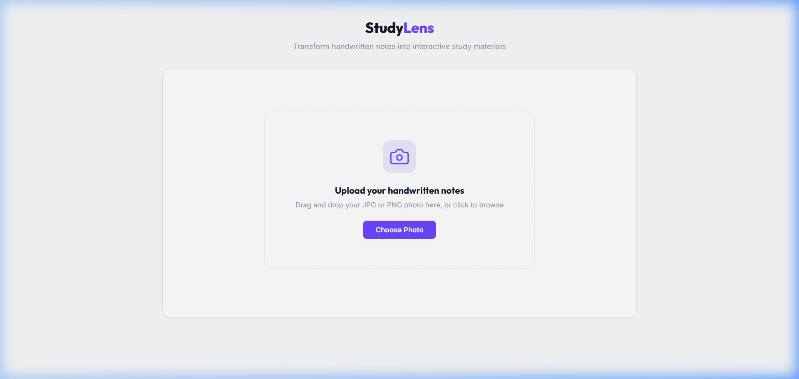

# 📚 StudyLens — Handwritten Notes to Study Materials

> AI-powered learning tool that transforms photos of handwritten notes into interactive flashcards, quizzes, mind maps, and summaries using Google Gemini's multi-modal capabilities.



## ✨ Features

| Feature | Description |
|---------|-------------|
| **Gemini Vision OCR** | Extracts text from handwritten note photos (PNG, JPG) — no external OCR libraries needed |
| **Flashcard Deck** | 8–12 auto-generated Q&A cards with 3D flip animations, shuffle, and keyboard navigation |
| **Interactive Quiz** | 5 MCQs with real-time correctness feedback, score tracking, and results summary |
| **Mind Map** | Hierarchical D3.js node tree with depth-based coloring, drag panning, and zoom |
| **Key Summaries** | 5 bullet-point takeaways with fade-in animations and copy-to-clipboard |
| **Session History** | Automatically saves last 10 sessions to localStorage for quick re-access |
| **PDF Export** | Print-optimized layout to export flashcards as a clean PDF |

## 🛠️ Tech Stack

| Layer | Technologies |
|-------|-------------|
| **Frontend** | React, Vite, Vanilla CSS, D3.js, Lucide Icons |
| **Backend** | Python, FastAPI, Uvicorn |
| **AI/ML** | Google Gemini 2.5 Flash (Vision OCR + Structured JSON Generation) |
| **Architecture** | Single-prompt generation — all 4 study formats in one API call |

## 🏗️ Architecture

```
┌─────────────────┐     POST /process-notes     ┌──────────────────┐
│                 │  ─────────────────────────►  │                  │
│  React Frontend │                              │  FastAPI Backend  │
│  (Vite Dev)     │  ◄─────────────────────────  │                  │
│  localhost:5173  │     JSON Response            │  localhost:8000   │
└─────────────────┘                              └────────┬─────────┘
                                                          │
                                                          │ 1. Vision OCR
                                                          │ 2. Structured Generation
                                                          ▼
                                                 ┌──────────────────┐
                                                 │  Google Gemini   │
                                                 │  2.5 Flash API   │
                                                 └──────────────────┘
```

## 🚀 Getting Started

### Prerequisites
- Python 3.9+
- Node.js 18+
- [Google Gemini API Key](https://aistudio.google.com/apikey)

### Backend Setup

```bash
cd backend

# Create virtual environment (recommended)
python -m venv venv
# Windows:
venv\Scripts\activate
# Mac/Linux:
source venv/bin/activate

# Install dependencies
pip install -r requirements.txt

# Configure environment
cp .env.example .env
# Edit .env and add your GEMINI_API_KEY

# Start the server
python main.py
```

The API will be running at `http://localhost:8000`

### Frontend Setup

```bash
cd frontend

# Install dependencies
npm install

# Start dev server
npm run dev
```

The app will be running at `http://localhost:5173`

## 📂 Project Structure

```
StudyLens/
├── backend/
│   ├── main.py                 # FastAPI server + unified generation endpoint
│   ├── ocr_engine.py           # Gemini Vision OCR pipeline
│   ├── requirements.txt        # Python dependencies
│   └── .env.example            # Environment variable template
├── frontend/
│   ├── src/
│   │   ├── App.jsx             # Main app with tab navigation & history
│   │   ├── UploadZone.jsx      # Drag-and-drop image upload
│   │   ├── FlashcardDeck.jsx   # 3D flip card component
│   │   ├── QuizMode.jsx        # MCQ quiz with scoring
│   │   ├── MindMap.jsx         # D3.js hierarchical tree
│   │   ├── Summary.jsx         # Key takeaways display
│   │   └── index.css           # Complete design system
│   └── index.html
├── assets/
│   └── screenshot.png
├── .gitignore
└── README.md
```

## ⚙️ How It Works

1. **Upload** — User uploads a photo of handwritten notes
2. **OCR** — Gemini Vision extracts text, preserving structure and formatting
3. **Generate** — A single structured prompt generates all 4 study formats as JSON
4. **Display** — React renders interactive flashcards, quiz, mind map, and summary
5. **Save** — Session is cached in localStorage for later review

## 🔧 Error Handling & Reliability

- **JSON Mode** — API requests use `response_mime_type: "application/json"` for guaranteed valid output
- **Auto-Retry** — 3-attempt pipeline with exponential backoff for rate limits (429) and parse failures
- **Graceful Errors** — User-friendly error messages with one-click retry

## 📝 License

This project is open source and available under the [MIT License](LICENSE).
